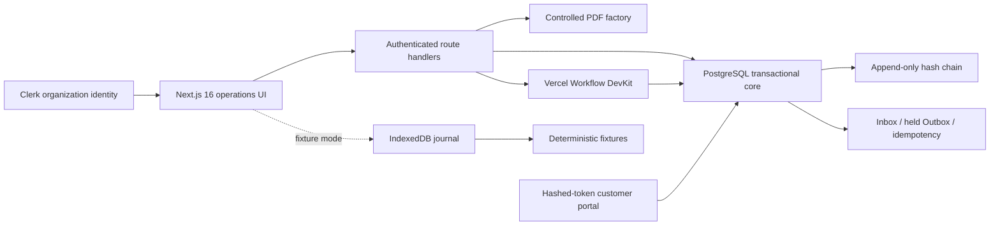

# MERIDIAN 10 — Autonomous Trade OS

A Level 10 foreign-trade operations system with two explicit runtime modes: a public deterministic laboratory and an authenticated, organization-scoped PostgreSQL core. It covers lead intake, evidence-backed due diligence, customer records, quotation and margin controls, orders, atomic inventory, eight trade-document PDFs, durable workflows, shipment milestones, secure customer portals, supplier operations, order profit, policy guardrails, and a tamper-evident audit trail.

**Live demo:** [meridian-10-autonomous-trade-os.vercel.app](https://meridian-10-autonomous-trade-os.vercel.app/)

> The public deployment defaults to deterministic fictional data. Database mode supports shared operational records, but all external effects remain deliberately held as drafts: the system does not autonomously send outreach, place purchase orders, file customs declarations, instruct carriers, or move money. Customs and origin documents are controlled drafts requiring licensed professional review.

## What the test covers

1. Autonomous acquisition — ICP scoring, source provenance, entity resolution and duplicate prevention.
2. Customer due diligence — evidence timestamps, confidence, TTL, risk scoring and human-review holds.
3. Customer 360 — isolated customer records, next-best-action drafts, quotes, orders and exportable profiles.
4. Trade documents — quotation, pro forma invoice, commercial invoice, purchase order, packing list, customs draft, origin draft and shipment report.
5. Delivery reporting — eight order milestones, evidence, exception-first monitoring and a redacted customer portal.
6. Lookalike discovery — explainable product, industry, channel, size and region similarity.
7. Profit and expenses — landed cost, FX, freight, duty, commission, bank fees, overhead and scenario stress tests.
8. Supplier and inventory operations — weighted scorecards, atomic reservations, idempotency, optimistic concurrency and oversell protection.
9. Additional controls — durable workflows, protected daily cron, organization RBAC, Inbox/Outbox, idempotency records, command palette, fixture-mode IndexedDB recovery, policy-as-code and hash-chain verification.

## Runtime modes

| Mode | Data and identity | Intended use |
|---|---|---|
| `fixture` (default) | Deterministic synthetic records, demo identity, IndexedDB browser journal | Public evaluation with no credentials and no real-world effects |
| `database` | Neon-compatible PostgreSQL, Clerk organization identity, server-derived tenant scope | Shared authenticated operations with atomic writes and controlled drafts |

Database mode fails closed when its database or identity configuration is incomplete. The browser never supplies a trusted tenant identifier.

## Architecture



The integrated core enforces organization scope, role checks, atomic stock and order transactions, idempotent retries, audit-chain continuity, held customer-update drafts, and hashed portal tokens. See [Architecture](docs/ARCHITECTURE.md), [integration blueprint](docs/INTEGRATION-BLUEPRINT.md), [threat model](docs/THREAT-MODEL.md) and [runbook](docs/RUNBOOK.md).

## Run locally

Requirements: Node.js 24 and npm.

```bash
npm ci
npm run dev
```

Open `http://localhost:3000`. No external account or production credential is required for the synthetic demo.

To activate shared mode, copy `.env.example`, configure a PostgreSQL database and Clerk organization application, generate a 32+ character `PORTAL_TOKEN_SECRET`, then run:

```bash
npm run db:migrate
npm run db:seed:demo # optional deterministic onboarding dataset
DATA_MODE=database AUTH_MODE=clerk npm run dev
```

Keep `OUTBOUND_MODE=draft`. Database mode does not imply permission to contact customers or execute trade, payment, carrier, or customs actions.

## Verification

```bash
npm run lint
npm run typecheck
npm test
npm run build
npx playwright install chromium webkit
npm run test:e2e
```

Public deployment verification:

```bash
PLAYWRIGHT_BASE_URL=https://meridian-10-autonomous-trade-os.vercel.app npm run test:public
```

The automated suites also run migrations against a fresh in-process PostgreSQL engine and verify atomic inventory, order intake, milestone transitions, portal rotation, tenant isolation, idempotency, audit/outbox side effects, database document projection and shared workspace hydration. See [Test matrix](docs/TEST-MATRIX.md).

## Safe extension points

- Replace synthetic acquisition sources only through explicit, lawful provider contracts with provenance and rate limits.
- Put real outreach behind per-tenant approval policies, suppression lists and auditable drafts.
- Connect contracted acquisition, screening, communications, logistics and accounting providers through the existing Inbox/held-Outbox boundary.
- Send real documents only after legal, customs, tax and banking review gates.
- Keep risk screening results as evidence-backed decisions with appeal and human-review paths.

## License

MIT. The license covers the software, not legal, customs, tax, sanctions or financial advice.
