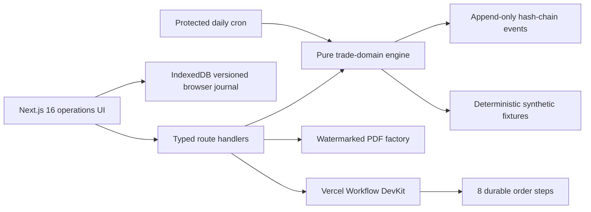

# MERIDIAN 10 — Autonomous Trade OS

A Level 10, end-to-end foreign-trade operations laboratory: synthetic lead discovery, evidence-backed due diligence, customer records, explainable lookalikes, quotation and margin controls, eight trade-document PDFs, durable order workflows, shipment updates, supplier scoring, versioned inventory, order-level profit, policy guardrails, and a tamper-evident audit trail.

**Live demo:** [meridian-10-autonomous-trade-os.vercel.app](https://meridian-10-autonomous-trade-os.vercel.app/)

> Every company, contact, supplier, order, event and financial figure is deterministic fictional data. The system does not scrape real personal data, send outreach, place orders, file customs declarations, instruct carriers, or move money. Customs and origin documents are watermarked drafts requiring licensed professional review.

## What the test covers

1. Autonomous acquisition — ICP scoring, source provenance, entity resolution and duplicate prevention.
2. Customer due diligence — evidence timestamps, confidence, TTL, risk scoring and human-review holds.
3. Customer 360 — isolated customer records, next-best-action drafts, quotes, orders and exportable profiles.
4. Trade documents — quotation, pro forma invoice, commercial invoice, purchase order, packing list, customs draft, origin draft and shipment report.
5. Delivery reporting — eight order milestones, evidence, exception-first monitoring and a redacted customer portal.
6. Lookalike discovery — explainable product, industry, channel, size and region similarity.
7. Profit and expenses — landed cost, FX, freight, duty, commission, bank fees, overhead and scenario stress tests.
8. Supplier and inventory operations — weighted scorecards, atomic reservations, idempotency, optimistic concurrency and oversell protection.
9. Additional controls — durable workflows, protected daily cron, command palette, IndexedDB journal, cross-tab sync, snapshot recovery, policy-as-code and hash-chain verification.

## Architecture



The public laboratory intentionally uses a local browser journal instead of pretending to be a shared multi-user ERP. A production conversion requires authenticated tenancy, a shared transactional database, managed secrets, verified external data contracts, role-based approvals and licensed compliance owners. See [Architecture](docs/ARCHITECTURE.md), [Threat model](docs/THREAT-MODEL.md) and [Runbook](docs/RUNBOOK.md).

## Run locally

Requirements: Node.js 22+ and npm.

```bash
npm ci
npm run dev
```

Open `http://localhost:3000`. No external account or production credential is required for the synthetic demo.

## Verification

```bash
npm run lint
npm run typecheck
npm test
npm run build
npx playwright install chromium webkit
npm run test:e2e
```

Public deployment verification:

```bash
PLAYWRIGHT_BASE_URL=https://meridian-10-autonomous-trade-os.vercel.app npm run test:public
```

The automated suites cover domain invariants, API contracts, PDF signatures and watermarks, workflow steps, 15 operator workspaces, the redacted customer portal, desktop Chromium, mobile WebKit and public runtime behavior. See [Test matrix](docs/TEST-MATRIX.md).

## Safe extension points

- Replace synthetic acquisition sources only through explicit, lawful provider contracts with provenance and rate limits.
- Put real outreach behind per-tenant approval policies, suppression lists and auditable drafts.
- Replace browser persistence with transactional storage while retaining idempotency keys and optimistic versions.
- Send real documents only after legal, customs, tax and banking review gates.
- Keep risk screening results as evidence-backed decisions with appeal and human-review paths.

## License

MIT. The license covers the software, not legal, customs, tax, sanctions or financial advice.
