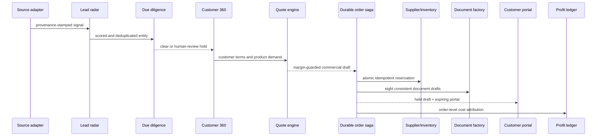

# Architecture

## Design objective

MERIDIAN 10 provides one traceable digital thread from a prospect signal to order profit. The same application supports a deterministic public laboratory and an authenticated shared-data mode; it never represents draft external actions as completed real-world effects.

## Runtime layers

| Layer | Responsibility | Current implementation |
|---|---|---|
| Experience | 15 operator workspaces and a cost-redacted customer view | Next.js App Router, React 19 |
| Identity | Organization membership and application roles | Clerk session plus provisioned PostgreSQL membership |
| Browser state | Fixture-mode recovery and same-browser synchronization only | IndexedDB through `idb`, `BroadcastChannel` |
| API | Validated, role-scoped business endpoints | Next.js route handlers; tenant is derived server-side |
| Domain | Scoring, due diligence, similarity, quote, profit, stock, automation and audit rules | Pure TypeScript modules |
| Transactional core | Shared business records, versions and atomic invariants | Drizzle ORM, PostgreSQL, SQL transaction functions |
| Reliability | Replay safety and provider event recovery | Idempotency records, Inbox and held Outbox |
| Documents | Eight consistent one-page trade PDFs | `pdf-lib`, synthetic or controlled-draft watermark |
| Orchestration | Crash-safe order-to-delivery saga | Vercel Workflow DevKit; idempotent database steps |
| Customer portal | Cost-redacted order and milestone projection | Expiring HMAC-derived token; database stores only SHA-256 hash |
| Scheduling | Daily dry-run control loop | Vercel Cron with bearer-secret enforcement |
| Hosting | Immutable builds and managed functions | Vercel |

## Digital thread

## Invariants

- Database tenant scope is derived from the authenticated organization membership, never request input.
- A repeated reservation request cannot reserve twice.
- A repeated order-intake, milestone or portal-grant request cannot duplicate side effects.
- A stale inventory version cannot overwrite a newer one.
- Available inventory cannot become negative.
- Quote totals and profit calculations use one normalized cost model.
- Customer views cannot expose internal cost, margin or risk notes.
- Potential sanctions matches pause the flow for review.
- Customs and origin PDFs always state that they are drafts.
- Each audit event contains the previous event hash.
- Portal tokens expire, can be rotated, and are never stored in plaintext.
- Cross-organization document, inventory, order, milestone and portal reads/writes are rejected.

## External-effect boundary

The integrated core now includes authenticated organizations and shared transactional persistence. Production activation still requires managed database backup/restore, secret rotation, observability, and provider-specific contracts. Real acquisition, screening, FX, logistics, communications, customs, banking and accounting adapters must enter through the Inbox/Outbox boundary and remain subject to explicit approval policies, reconciliation, rollback and licensed compliance ownership.
