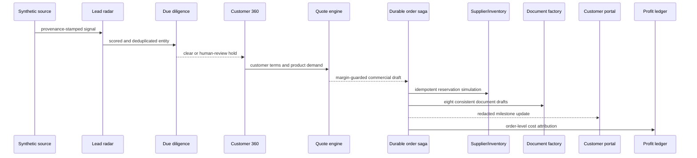

# Architecture

## Design objective

MERIDIAN 10 demonstrates one traceable digital thread from a prospect signal to order profit without claiming that a public browser demo is a production ERP. The design separates deterministic domain decisions from UI state, HTTP transport, PDF rendering and durable orchestration.

## Runtime layers

| Layer | Responsibility | Current implementation |
|---|---|---|
| Experience | 15 operator workspaces and a cost-redacted customer view | Next.js App Router, React 19 |
| Browser state | Versioned local state, recovery and same-browser synchronization | IndexedDB through `idb`, `BroadcastChannel` |
| API | Validation-friendly, testable business endpoints | Next.js route handlers |
| Domain | Scoring, due diligence, similarity, quote, profit, stock, automation and audit rules | Pure TypeScript modules |
| Documents | Eight consistent one-page trade PDFs | `pdf-lib`, mandatory synthetic watermark |
| Orchestration | Crash-safe order-to-delivery saga | Vercel Workflow DevKit, eight durable steps |
| Scheduling | Daily dry-run control loop | Vercel Cron with bearer-secret enforcement |
| Hosting | Immutable builds and managed functions | Vercel |

## Digital thread

## Invariants

- All fixtures carry `tenantId` and deterministic identifiers.
- A repeated reservation request cannot reserve twice.
- A stale inventory version cannot overwrite a newer one.
- Available inventory cannot become negative.
- Quote totals and profit calculations use one normalized cost model.
- Customer views cannot expose internal cost, margin or risk notes.
- Potential sanctions matches pause the flow for review.
- Customs and origin PDFs always state that they are drafts.
- Each audit event contains the previous event hash.
- Cross-tenant snapshot imports are rejected.

## Production conversion

The public version deliberately omits authentication and shared server persistence. A real deployment must add:

1. authenticated organizations, RBAC, least-privilege service identities and approval policies;
2. a transactional shared database with row-level tenancy, backups and regional retention controls;
3. contracted acquisition, screening, FX, logistics, customs and communications providers;
4. encrypted secret management, key rotation, centralized logs, traces and alerting;
5. legal owners for privacy, outreach, export controls, sanctions, customs, tax and payments;
6. sandbox-to-production promotion, reconciliation, rollback and business-continuity drills.
