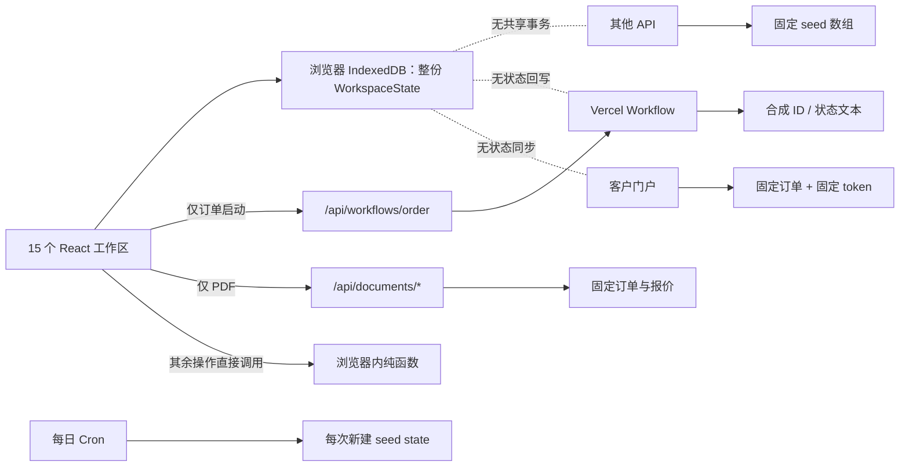
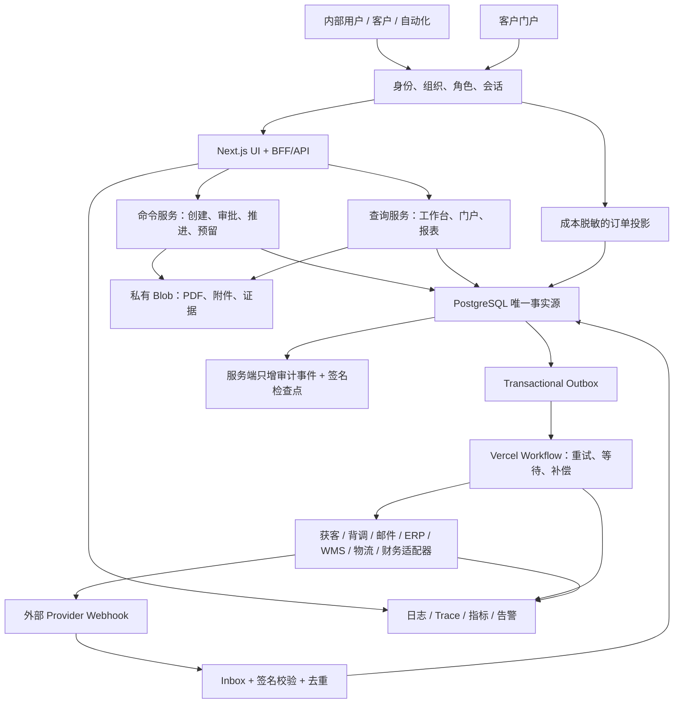
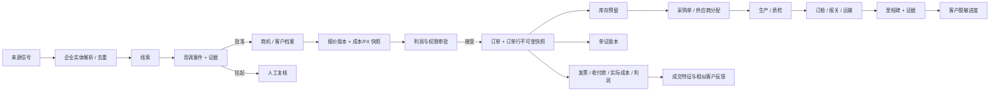

# MERIDIAN 10 全面摸底与底层打通方案

> 审计日期：2026-08-09
> 审计对象：当前本地仓库、线上 Vercel 部署、15 个运营工作区、客户门户、11 类服务端路由、Vercel Workflow、测试与交付文档
> 文档性质：现状证据、目标架构与实施提案；本轮未把真实客户、外联、采购、支付、清关或物流接入生产

> 实施状态：本文保留为改造前基线和设计依据；其中的共享底座、身份租户、核心事务、Workflow、里程碑与门户问题已在 `integrated-core-v1` 中实现。最新结果见 [集成底座实施报告](INTEGRATION-IMPLEMENTATION-REPORT.md)。

## 1. 结论先行

当前系统是一套完成度很高的“可交互业务演示”，但还不是一套底层打通的外贸业务系统。

界面让人感觉所有模块围绕同一条业务主线协作，代码内部实际上存在四套彼此分离的事实来源：

1. 运营界面把完整 `WorkspaceState` 存在单台设备的 IndexedDB 中；
2. 服务端 API 每次请求重新读取固定种子数据；
3. Vercel Workflow 只返回合成编号和状态文本，不读写业务数据；
4. 客户门户直接读取固定订单和固定令牌，不读取运营界面的最新状态。

因此，线索、背调、客户、报价、订单、采购、库存、单证、里程碑和财务并没有共享同一个数据库事务，也没有通过持久化事件真正联动。当前最核心的问题不是缺几个按钮，而是缺少“唯一事实源 + 状态机 + 事务 + 身份权限 + 外部系统适配器”这五层底座。

建议不要推倒重做现有界面。最稳妥的路径是保留现有 UI、纯领域计算、PDF 版式、测试夹具和 Workflow 骨架，在其下方建立一个以 PostgreSQL 为唯一事实源的模块化单体，再按业务优先级逐条替换浏览器模拟逻辑。

推荐目标路线：

- Next.js 保留为运营台、客户门户和 BFF/API；
- Neon PostgreSQL 作为唯一业务事实源；
- Clerk Organizations 或企业现有 IdP 负责登录、组织和角色；
- Vercel Workflow 负责长流程、暂停、重试和人工审批等待；
- 私有 Vercel Blob 保存不可变单证、附件和证据；
- PostgreSQL Inbox/Outbox 负责外部事件去重和副作用可靠投递；
- 所有第三方服务都通过可替换 Provider Adapter 接入；
- Vercel 日志、Trace、业务指标和告警组成统一可观测层。

这条路线能最大限度保留当前成果，同时避免过早拆微服务造成新的复杂度。

## 2. 审计边界与证据

### 2.1 本轮实际检查

- 阅读了完整领域类型、种子数据、浏览器存储、主 UI、全部 API、Workflow、客户门户、CI、运行手册、架构与测试矩阵；
- 核对了依赖、环境变量、Vercel Cron 和本地 Git 状态；
- 执行 lint、TypeScript 检查、Vitest、生产构建和线上 Playwright 冒烟测试；
- 对线上环境执行三项安全的合成数据探针；
- 核对项目最初的范围和治理文件，确认它原本明确定位为“公开合成演示”，而非生产 ERP。

### 2.2 已通过的工程基线

| 检查 | 结果 |
|---|---|
| ESLint | 通过，0 错误 |
| TypeScript | 通过，0 错误 |
| Vitest | 8 个测试文件、148 项测试全部通过 |
| Next.js 生产构建 | 通过；识别 1 个 Workflow、8 个编译步骤 |
| 线上 Playwright | 6/6 通过 |
| 线上首页、健康检查、PDF、Workflow 排队、门户脱敏、Cron 未授权拒绝 | 均符合现有“合成演示”设计 |

这说明现有代码质量和演示稳定性是合格的。它没有证明真实数据连通、跨用户一致性、事务安全或第三方集成成立。

### 2.3 生产探针直接证据

| 探针 | 预期的生产行为 | 实际结果 | 结论 |
|---|---|---|---|
| 使用同一个 `requestId` 连续预留库存两次 | 第二次应返回幂等重放，且不再次预留 | 两次均为 HTTP 200 `RESERVED`，两次都从版本 7 算到版本 8 | 幂等集合只存在于单次请求/浏览器内，没有服务端持久化 |
| 请求不存在订单的报价 PDF | 应返回 404 | HTTP 200，仍生成 PDF，文件名使用不存在的订单号 | 文档生成器静默回退到第一条种子订单，可能造成错单证 |
| 请求无效门户令牌 | 应返回 401/404/410，并留下安全事件 | HTTP 200 HTML | 令牌只做页面分支，没有真实授权资源和正确状态码 |

### 2.4 初始项目边界证据

`.project-os/00-intake/concept-baseline.json` 明确写明：

- 使用确定性合成数据和浏览器本地持久化；
- 不处理真实 PII；
- 不发送真实外联；
- 不提交真实采购、付款、物流或清关指令；
- 不宣称具备生产上线资格。

因此，当前断层不是一次偶然的编码遗漏，而是“演示范围”与“真实业务系统目标”之间尚未完成的产品升级。

## 3. 当前真实架构



### 3.1 四个事实源造成的具体后果

| 事实源 | 保存什么 | 生命周期 | 谁能看到 | 主要问题 |
|---|---|---|---|---|
| React 内存 | 当前页面状态、滑块、Toast、Workflow runId | 当前页面会话 | 当前标签页 | 刷新或切换上下文后丢失部分状态 |
| IndexedDB | 整份 `WorkspaceState` | 当前浏览器/设备 | 同源浏览器；BroadcastChannel 仅同浏览器标签页 | 不是多人数据库，无法事务锁定、查询、审计或备份 |
| API 种子数据 | 线索、库存、报价、订单、财务夹具 | 每次函数调用重新开始 | 任意调用者 | API 与 UI 当前状态不一致，写入不会延续 |
| Workflow/门户种子 | 合成步骤结果、固定订单 | 每次运行或请求 | Workflow/公开门户 | 不回写订单，不关联真实文档、消息、库存或客户 |

### 3.2 架构文档与运行事实的差异

README 图示为“UI → Typed APIs → Domain”，但 `src/components/trade-os.tsx` 直接导入并调用获客、报价、相似度、库存和利润函数。整个 UI 只有订单 Workflow 启动使用 `fetch()`，PDF 使用普通链接。也就是说，API 层存在，但多数页面并未使用它。

这是最容易产生误判的地方：同一套规则既可以在浏览器运行，也可以在 API 运行，但两边没有共享数据，所以“代码复用”不等于“系统连通”。

## 4. 成熟度定义

本方案不用模糊百分比，而采用可验收的五级模型：

| 等级 | 定义 |
|---|---|
| M0 展示 | 静态或固定夹具，只展示结果 |
| M1 本地可操作 | 浏览器内可以计算或修改，但没有服务器唯一事实源 |
| M2 服务器闭环 | 有认证、数据库、事务、持久化状态机和审计 |
| M3 外部集成 | 与真实授权数据源、消息、ERP/WMS/物流等通过沙箱和生产适配器连接 |
| M4 生产受控 | 有权限分离、人工审批、监控、对账、备份恢复、合规责任和上线门禁 |

当前整体是 **M1**。Workflow 排队基础设施具备部分 M2 形态，但 Workflow 内部没有业务读写，因此不能把它计为业务闭环。

## 5. 15 个工作区逐项摸底

| 工作区 | 当前实际能力 | 主要断点 | 当前级别 | 建议优先级 |
|---|---|---|---|---|
| 01 指挥中心 | 一部分指标从浏览器状态计算；任务数、来源数、质量/交付率、43% 进度等多处硬编码 | 没有统一查询模型、实时任务、异常或 SLA 数据 | M0/M1 | P2 |
| 02 自主获客 | 对本地夹具做评分、去重并写回浏览器 | 无真实来源连接、抓取队列、实体主键、同意/退订、来源限流 | M1 | P1 |
| 03 客户背调 | 展示种子证据；API 只给调用者提交的数据打分 | 无企业注册、制裁、负面新闻、信用数据源；无案件、证据快照和审批 | M0 | P1 |
| 04 客户 360 | 浏览夹具、导出 JSON；“草稿/待办”只弹 Toast | 无联系人、活动、任务、邮件草稿、所有者权限、客户合并 | M1 | P1 |
| 05 相似客户 | 浏览器运行可解释 weighted-jaccard | 只比较当前夹具；无特征版本、来源约束、排除名单和反馈闭环 | M1 | P3 |
| 06 跟进漏斗 | 根据本地线索阶段只读分栏；按钮只弹 Toast | 无阶段变更、跟进序列、任务、消息 Outbox、退订和送达回执 | M0/M1 | P1 |
| 07 报价驾驶舱 | 本地计算成本、折扣和利润 | 滑块结果不保存；无报价版本、审批、有效期、FX 快照、发送/接受状态 | M1 | P1 |
| 08 贸易单证 | 服务端可生成 8 类水印 PDF | 读取固定种子；无订单快照、版本、签核、私有存储、附件和发送记录；未知订单回退 | M1 | P1 |
| 09 交付控制塔 | 本地推进里程碑；可排队一个 dry-run Workflow | 里程碑不更新订单阶段、门户、库存、采购、财务或消息；Workflow 只返回合成文本 | M1 + 编排壳 | P1 |
| 10 供应商网络 | 展示评分；“再平衡”只弹 Toast | 无供应商产品、价格版本、询价、采购单、产能、质检、交期回写 | M0 | P2 |
| 11 库存孪生 | 浏览器内演示乐观锁和幂等 | 服务器请求每次重置；无库存流水、仓库、批次、预留记录或供应商/WMS 同步 | M1 | P1 |
| 12 利润与费用 | 对种子台账做本地压力测试 | 无发票、收付款、应收应付、实际成本、汇率历史、分摊和会计对账 | M1 | P2 |
| 13 合规中心 | 展示 8 条规则；“红队演练”只把本地 `ran` 设为 true | 无真实策略执行、角色授权、案件队列、证据留存、数据生命周期 | M0 | P0/P1 |
| 14 自动化运行 | 点击后插入一条预制 `SUCCEEDED` 运行记录 | 未连接 Cron、Workflow、API、重试、死信、人工挂起或恢复 | M1 | P1 |
| 15 审计与恢复 | 本地 FNV-1a 哈希链、JSON 导入导出 | 客户端可重写整份账本；不是数字签名、服务器只增账本或受控备份 | M1 | P0 |
| 客户门户 | 固定 `demo-nordwerk` 令牌、固定第一笔订单、成本脱敏 | 无用户/订单绑定、令牌哈希、过期/撤销、动态里程碑、下载授权和访问审计 | M0 | P1 |

## 6. 关键逻辑断点与风险

### 6.1 Critical：没有服务端身份、租户和授权

- `tenantId` 是客户端提交或固定字符串，不是从可信登录会话推导；
- 没有用户、组织、成员、角色、权限或审批人模型；
- 所谓“跨租户拒绝”只发生在浏览器导入 JSON 时；
- 所有业务 API 和 PDF 基本公开可调用。

生产要求：任何服务端查询都必须从认证会话取得 `organizationId`，不能信任请求体中的租户字段；数据库查询必须带组织范围，并用自动化测试证明跨组织不可见。

### 6.2 Critical：库存“原子、幂等、乐观锁”只在函数内成立

`/api/inventory/reserve` 每次从固定数组开始，并创建新的 `Set`。线上探针已经证明重复 `requestId` 会再次返回 `RESERVED`。

生产要求：库存预留必须在一个 PostgreSQL 事务中完成：

1. 先用 `(organization_id, idempotency_key)` 唯一约束查询/插入请求；
2. 锁定对应库存余额或使用条件更新；
3. 校验版本、可售量和安全库存；
4. 写入不可变 `stock_movement` 与 `stock_reservation`；
5. 更新余额和版本；
6. 在同一事务写入 Audit Event 与 Outbox Event；
7. 冲突返回 409，重复请求返回首次结果。

### 6.3 Critical：Workflow 有耐久性，但没有业务效果

当前五个业务函数分别返回 `RSV-*`、`DOCSET-*`、`PLAN-*`、`OUTBOX-*` 等字符串。它们没有：

- 查询订单当前版本；
- 写库存预留；
- 生成并保存单证；
- 写里程碑；
- 创建消息 Outbox；
- 等待审批或第三方回调；
- 把运行结果关联回订单。

生产要求：Workflow 输入只保留 `organizationId/orderId/commandId`，每一步重新从数据库加载最新状态，在事务内写结果；对第三方调用使用幂等键；需要人工决定或外部回调时使用可恢复 Hook，而不是假装已经完成。

### 6.4 High：单证可能“错订单但成功返回”

文档生成器对未知订单静默回退到第一条种子订单，路由仍把未知订单号写进文件名。这是生产中不能接受的错配风险。

生产要求：

- 未知订单严格 404；
- PDF 只读取已批准的不可变订单/报价快照；
- 每次生成创建 `document_version`；
- 文件名、正文、数据库主键和内容摘要必须一致；
- 单证存入私有对象存储，下载必须鉴权；
- 报关、原产地、付款和采购类文件必须经过相应审批状态。

### 6.5 High：状态推进没有统一状态机

“推进里程碑”只改变 milestones 数组，不改变订单 stage，也不触发采购、库存、单证、消息、财务或客户门户。

生产要求：状态迁移由服务端命令处理器执行，并具备前置条件、允许角色、版本、审计和副作用事件。UI 只能提交“请求迁移”，不能直接写最终状态。

### 6.6 High：测试证明了局部规则，未证明系统闭环

已有测试值得保留，但缺少以下生产级测试：

- 两个用户、两个组织之间的数据隔离；
- 两个并发请求抢同一库存；
- 重复 Webhook/Workflow/消息不会重复执行；
- Provider 超时、重试、乱序和部分失败；
- 报价接受后生成不可变订单快照；
- 里程碑更新后客户门户立即读取同一数据；
- 单证与订单版本一致；
- 数据迁移、备份恢复、灾难恢复和财务对账；
- 真实授权矩阵和人工双人复核。

### 6.7 High：一些 UI 文案高于实际能力

`SIGNED`、`APPEND-ONLY`、`REAL-TIME`、`Atomic reservation`、`9.8/10` 等词在演示语境可以帮助表达设计目标，但接入真实数据后必须由可验证控制支撑。建议在打通期间把这些状态改为“SIMULATED”或从真实控制状态派生，避免运营人员误判。

### 6.8 Medium：本地仓库没有 Git remote

当前本地 `main` 工作树干净，但 `git remote -v` 为空。线上 GitHub 仓库和 GitHub Actions 存在，当前本地目录却没有 `origin`。这不会影响本次审计，但会影响后续自动建分支、推送和 PR 的可靠性。进入实施前应先核对本地仓库与 GitHub 仓库是否是同一提交历史，再安全绑定 remote，不能盲目覆盖。

## 7. 推荐目标架构：模块化单体 + 可靠异步边界

### 7.1 为什么不是立即拆微服务

当前真正缺的是业务事实和边界，不是部署单元数量。先用一个 PostgreSQL、一套应用服务和明确模块边界，可以在同一事务中保证报价、订单、库存、审计和 Outbox 一致。等到团队、吞吐量或合规边界真正要求独立部署时，再按模块拆分。

### 7.2 目标图



### 7.3 核心组件职责

| 组件 | 唯一职责 |
|---|---|
| Next.js UI/BFF | 展示、表单、会话校验、命令入口、查询聚合；不直接决定最终业务状态 |
| Application Services | 执行状态机、权限、业务规则和事务 |
| PostgreSQL | 客户、报价、订单、库存、财务、运行状态和审计的唯一事实源 |
| Vercel Workflow | 跨分钟/小时/天的可靠流程、重试、等待审批、等待 Webhook、补偿 |
| Inbox | 验签、去重、记录所有外部回调；重复和乱序可安全处理 |
| Outbox | 与业务事务同时写入待执行副作用，避免“数据库成功但邮件/ERP 失败” |
| Provider Adapters | 把第三方字段和错误转换为统一领域合同，允许替换服务商 |
| Private Blob | 保存不可变 PDF、合同、附件、背调证据和质检证据；数据库保存元数据和摘要 |
| Audit Ledger | 服务端只增事件；记录谁、何时、基于什么版本做了什么；定期生成签名检查点 |
| Observability | 以 `requestId/correlationId/organizationId/workflowRunId` 串联 UI、API、DB、Workflow 和 Provider |

## 8. 唯一业务主线



这条线上的每个箭头都必须对应以下至少一项：数据库外键、状态迁移、领域事件或 Provider 回执。不能再用页面跳转或 Toast 代表业务已经发生。

## 9. 最小生产数据模型

### 9.1 身份与租户

- `organizations`
- `users`
- `memberships`
- `roles`
- `permissions`
- `role_permissions`
- `approval_policies`
- `approval_requests`
- `sessions/security_events`（可由身份供应商托管，业务侧保存关联和审计）

### 9.2 获客、客户与跟进

- `companies`：企业主体主记录，不把 Lead 和 Customer 当成两套公司；
- `company_aliases`：名称、域名、注册号、地址等去重键；
- `contacts`：联系人及来源、合法依据、同意状态、保留期限；
- `lead_signals`：每条采购/展会/网站/目录信号；
- `source_observations`：原始来源、时间、摘要、证据摘要；
- `leads`：资格、评分、阶段和所有者；
- `opportunities`：金额、概率、产品需求和下一动作；
- `activities`：电话、邮件、会议、备注；
- `tasks`：负责人、截止时间、完成状态；
- `communication_preferences`、`suppression_entries`：退订、禁止联系和渠道偏好。

### 9.3 背调与合规

- `due_diligence_cases`
- `due_diligence_evidence`
- `screening_hits`
- `risk_decisions`
- `evidence_expirations`
- `compliance_holds`
- `policy_evaluations`
- `manual_reviews`

任何 CLEAR/REVIEW/BLOCKED 结论都要能回到证据版本、规则版本和决策人。

### 9.4 产品、供应商和采购

- `products`、`product_versions`
- `suppliers`、`supplier_sites`
- `supplier_products`
- `supplier_price_versions`
- `supplier_capacity_snapshots`
- `supplier_performance_events`
- `requests_for_quote`、`supplier_quotes`
- `purchase_orders`、`purchase_order_lines`
- `production_batches`、`quality_inspections`

当前缺失最关键的关系是“哪个供应商在什么时间、什么 MOQ、什么币种、什么交期向哪个 SKU 供货”。没有这层，供应商评分、采购和库存无法真正连接。

### 9.5 报价与订单

- `quotes`
- `quote_versions`
- `quote_lines`
- `quote_cost_snapshots`
- `fx_rate_snapshots`
- `quote_approvals`
- `quote_deliveries`
- `quote_acceptances`
- `sales_orders`
- `sales_order_lines`
- `order_status_transitions`

报价接受时，必须把客户、地址、产品描述、数量、价格、成本假设、币种、汇率、Incoterm 和税费假设复制成不可变订单快照，不能让后续产品主数据变化改写历史订单。

### 9.6 库存与履约

- `warehouses`、`warehouse_locations`
- `inventory_balances`
- `stock_movements`
- `stock_reservations`
- `lots/serials`（按业务需要启用）
- `shipments`
- `containers`
- `shipment_bookings`
- `shipment_milestones`
- `milestone_evidence`
- `exceptions`

余额是流水的物化结果，流水才是可审计事实。不能只保存一个可任意覆盖的 `reserved` 数字。

### 9.7 单证、财务与平台运行

- `document_sets`
- `document_versions`
- `document_approvals`
- `attachments`
- `invoices`
- `payments`
- `receivables/payables`
- `cost_entries`
- `cost_allocations`
- `fx_rates`
- `profit_snapshots`
- `workflow_runs`
- `workflow_steps`
- `inbox_events`
- `outbox_messages`
- `idempotency_records`
- `audit_events`
- `portal_grants`
- `provider_connections`
- `sync_cursors`

## 10. 状态机与权限门禁

### 10.1 推荐状态机

| 对象 | 状态主线 | 强制门禁示例 |
|---|---|---|
| Lead | DISCOVERED → RESOLVED → QUALIFIED → RESEARCHING → APPROVED/HOLD/REJECTED → OUTREACH_READY → CONVERTED | 未有合法来源/退订检查不得进入 OUTREACH_READY |
| Due Diligence | OPEN → COLLECTING → AUTO_CLEAR/REVIEW_REQUIRED → APPROVED/REJECTED → EXPIRED | 潜在制裁匹配只能进 REVIEW_REQUIRED；证据过期自动失效 |
| Quote | DRAFT → COSTED → REVIEW_REQUIRED/APPROVED → SENT → ACCEPTED/REJECTED/EXPIRED | 折扣、利润、信用额度超阈值必须审批；发送后版本不可覆盖 |
| Order | DRAFT → CONFIRMED → PROCUREMENT → PRODUCTION → QC → BOOKED → CUSTOMS → IN_TRANSIT → DELIVERED → CLOSED | 每一步要求前置证据；禁止跳级；所有转换带版本 |
| Purchase Order | DRAFT → APPROVED → SENT → ACKNOWLEDGED → IN_PRODUCTION → RECEIVED/CANCELLED | 发出采购属于真实外部效果，必须满足审批策略 |
| Document | DRAFT → GENERATED → REVIEW_REQUIRED/APPROVED → ISSUED → SUPERSEDED/VOID | 清关/原产地/付款相关单证不能自动从 DRAFT 跳到 ISSUED |
| Outbox Message | DRAFT → APPROVED → QUEUED → SENT → DELIVERED/BOUNCED/FAILED/SUPPRESSED | 退订、域名、频率、审批和模板版本全部通过才可发送 |
| Payment | EXPECTED → INVOICED → PARTIAL/PAID → RECONCILED/REFUNDED/DISPUTED | 移动资金永远不由普通自动化直接触发 |

### 10.2 角色建议

- `org_admin`：组织、成员、连接器和全局策略；
- `sales`：线索、客户、商机、授权范围内报价；
- `compliance_reviewer`：背调、制裁、外联和数据处理审批；
- `procurement`：供应商、询价、采购单；
- `operations`：生产、质检、物流和里程碑；
- `finance`：信用、发票、收付款、成本和利润；
- `approver`：按金额/折扣/风险执行 maker-checker；
- `auditor`：只读业务与审计导出；
- `customer_portal`：仅访问被授权订单的脱敏投影。

同一个人可以有多个角色，但高风险动作要支持“发起人与批准人不能相同”。

## 11. API 与事务设计

### 11.1 API 原则

- 查询和命令分离；
- 服务端从会话推导组织和用户，不接收可信 `tenantId`；
- 所有写命令要求 `Idempotency-Key`；
- 所有可并发修改对象有 `version` 或 ETag；
- 不存在资源严格 404；无权访问统一返回受控的 404/403；过期门户授权返回 410；
- 业务冲突返回 409；策略拒绝返回 422；限流返回 429；
- 每个响应返回 `requestId`，每个长流程返回 `workflowRunId`；
- Provider 原始响应只保存为受限证据，不直接泄露到前端。

### 11.2 必须原子的事务

1. 报价接受：锁定报价版本 → 校验未过期 → 创建订单及订单行快照 → 写状态事件和 Outbox；
2. 库存预留：幂等记录 → 锁余额 → 校验版本/可售量 → 写预留和流水 → 更新余额 → 审计/Outbox；
3. 订单状态推进：锁订单 → 校验前置条件和权限 → 写转换/证据 → 更新投影 → Outbox；
4. 采购审批：锁 PO → 校验审批矩阵 → 写批准记录 → 创建待发送 Outbox；
5. 收款对账：保存 Provider Inbox → 去重 → 匹配发票 → 写付款和应收变化 → 更新利润投影。

### 11.3 Inbox/Outbox 约束

- `UNIQUE (organization_id, provider, external_event_id)`：外部事件不重复；
- `UNIQUE (organization_id, idempotency_key)`：业务命令不重复；
- Outbox Worker 至少一次执行，Adapter 必须幂等；
- 每个失败记录错误类别、尝试次数、下一次重试时间；
- 超过阈值进入 Dead Letter/人工处理队列；
- 严禁“数据库先提交，然后直接发邮件且不记录”。

## 12. 外部系统接入方案

### 12.1 适配器合同先于供应商选择

每类外部服务先定义内部接口，再选择供应商：

```text
ProviderAdapter
  healthCheck()
  pull(cursor)
  push(command, idempotencyKey)
  verifyWebhook(headers, rawBody)
  normalize(payload)
  classifyError(error) -> retryable | permanent | policy_hold
```

这样可以先用 Sandbox/Fake Adapter 完成端到端开发，再切换真实授权连接，而不让业务代码绑定某一家 API。

### 12.2 接入矩阵

| 能力 | 候选来源/系统 | 写入系统的规范对象 | 生产前置条件 |
|---|---|---|---|
| 潜客与采购信号 | 合法目录、展会、公司站、Apollo/Semrush 等候选 | `lead_signal`、`company`、`source_observation` | 合同、允许用途、地域规则、速率限制、来源证明 |
| 企业背调/KYB | 注册信息、制裁、负面新闻、信用服务 | `dd_evidence`、`screening_hit`、`risk_decision` | 合规负责人、误报流程、证据 TTL、数据许可 |
| CRM | HubSpot 或现有 CRM | `company/contact/opportunity/activity/task` | 字段主权、双向/单向、冲突规则、历史迁移 |
| 邮件与消息 | Gmail、Outlook、Resend 或企业网关 | `outbox_message`、`delivery_receipt` | 域名验证、退订、审批、频率限制、模板 |
| 供应商与采购 | 现有 ERP、供应商门户、邮件/RPA 过渡层 | `supplier_product/price/PO/acknowledgement` | 谁是价格和 PO 主系统、重复单防护、审批 |
| 库存/WMS | ERP/WMS/仓库文件或 API | `stock_movement/balance/reservation` | 库存主权、延迟容忍、对账频率、冲突处理 |
| 汇率与财务 | FX 数据、会计/ERP、支付回执 | `fx_rate/invoice/payment/cost_entry` | 会计科目映射、币种精度、对账和关账规则 |
| 物流 | 货代、承运人、跟踪聚合服务 | `shipment/booking/milestone/evidence` | Webhook 验签、乱序处理、时区、事件映射 |
| 文件与签署 | 私有 Blob、电子签章候选 | `document_version/approval/signature` | 文件保留、地区、访问、法律效力和证书策略 |

候选 Codex 插件可以帮助操作这些外部系统，但插件不应成为业务事实源。插件/连接器负责“读取或执行”，PostgreSQL 仍保存规范状态、幂等记录、授权证据和审计。

## 13. 客户门户打通设计

推荐两种模式：

1. 常用客户：正式登录 + 组织/联系人绑定；
2. 临时分享：高熵随机令牌，仅存哈希，绑定 `organizationId + customerId + orderId + permissions + expiresAt`，支持撤销和一次性使用。

门户只读取服务器生成的 `customer_order_projection`，该投影明确排除：

- 供应商名称与成本；
- 内部毛利/净利；
- 合规调查备注；
- 内部异常归因；
- 其他客户或订单数据。

每次访问记录 `portal_access_event`，下载单证时再次做订单级授权。里程碑一旦在运营台通过服务端状态机提交，门户应从同一数据库读取变化，而不是另维护一份页面夹具。

## 14. 单证系统打通设计

单证生成输入应是一个不可变 `DocumentSnapshot`：

- 订单版本；
- 买卖双方及地址版本；
- 订单行、数量、价格、币种和 Incoterm；
- 产品描述、HS Code、原产地声明；
- 包装、重量、箱数；
- 航次、港口、ETD/ETA；
- 生成规则版本和模板版本；
- 所需审批与当前审批状态。

生成流程：

1. 校验订单存在和调用者权限；
2. 读取一致快照；
3. 校验该文档类型的必填字段；
4. 生成 PDF；
5. 计算 SHA-256；
6. 上传到私有 Blob，路径包含组织、订单、类型和版本；
7. 写 `document_version`；
8. 根据类型进入 DRAFT/REVIEW_REQUIRED/APPROVED；
9. 只有授权版本可以在门户下载或进入发送 Outbox。

Vercel 官方的私有 Blob 模式要求所有读写鉴权，适合合同、发票和内部文件；文件应按不可变版本保存，避免覆盖缓存和审计歧义。

## 15. 自动化与 Workflow 打通设计

### 15.1 建议的十条耐久流程

1. `lead-ingestion`：拉取来源 → 解析 → 去重 → 评分 → 写线索；
2. `due-diligence`：收集证据 → 筛查 → 计算风险 → 自动放行或等待人工；
3. `follow-up-planner`：检查阶段/证据/偏好 → 生成任务/草稿 → 等待审批 → 发送；
4. `quote-approval`：成本/FX → 利润规则 → 等待审批 → 生成版本 → 发送；
5. `order-acceptance`：接受报价 → 建订单 → 预留库存 → 建采购需求；
6. `procurement`：供应商分配 → 审批 → 发 PO → 等确认/生产/质检；
7. `fulfillment`：订舱 → 单证 → 里程碑 → 异常 → 客户更新；
8. `document-generation`：快照 → 生成 → 存储 → 审批 → 发布；
9. `finance-reconciliation`：发票/付款/费用拉取 → 匹配 → 异常人工处理 → 利润快照；
10. `lookalike-refresh`：成交反馈 → 特征重算 → 候选排名 → 排除/合规过滤。

### 15.2 Workflow 运行规则

- Workflow 步骤不能信任启动时传入的完整对象，只传标识并重新读取数据库；
- 每一步可重试且必须幂等；
- 等待人工或 Provider 回调时持久暂停，不轮询浏览器；
- 业务状态和 Workflow 状态分开保存，但通过 `workflowRunId` 关联；
- 取消、超时、补偿和人工接管是正式状态；
- 任何“已发送/已下单/已付款”都必须有 Provider 回执或人工凭证，不能由 Workflow 自报成功。

## 16. 安全、隐私与合规底座

### 16.1 必须完成的控制

- 组织级身份、MFA/SSO 策略和最小权限；
- 高风险操作 maker-checker；
- 服务端租户强制和数据库行级测试；
- 真实 PII 分类、合法依据、同意、退订、访问、更正、删除和保留策略；
- Provider Secret 仅在托管环境变量/密钥系统中，支持轮换；
- Webhook 原始请求验签、时间窗和重放防护；
- 敏感字段加密/脱敏，日志禁止写联系人内容、令牌和完整 Provider Payload；
- API 和门户速率限制；
- 文件类型、大小、病毒扫描和下载授权；
- 审计事件服务端只增，并将高价值检查点做数字签名或外部归档；
- 数据备份、时间点恢复、恢复演练和删除验证；
- 清关、制裁、税务、会计和付款保留专业责任人。

### 16.2 自动化允许与禁止

| 可自动执行 | 条件自动执行 | 必须人工/外部授权 |
|---|---|---|
| 去重、评分、草稿、计算、提醒、读取状态、生成待审单证 | 低风险外联、授权范围内折扣、重复同步、普通里程碑通知 | 制裁潜在匹配结论、超权限价格、授信、采购发出、付款、真实报关、法律签署 |

“零点击”应通过预授权策略实现，而不是删除安全边界。低风险、可逆、规则清楚的动作可以永久授权；高风险动作应该集中成少量例外队列，而不是每一步都点击。

## 17. 可观测性与运营控制

### 17.1 每个事件必须带的关联字段

- `requestId`
- `correlationId`
- `organizationId`
- `actorId`
- `commandId/idempotencyKey`
- `entityType/entityId/entityVersion`
- `workflowRunId/workflowStep`
- `provider/providerRequestId`
- `outboxMessageId/inboxEventId`

### 17.2 业务指标

- 线索去重率、来源失败率、背调证据过期数；
- 人工复核等待时长、报价审批时长、报价接受率；
- 库存冲突/超卖阻止数、预留释放数；
- PO 确认延迟、供应商按时率、质检异常率；
- 里程碑延误、门户更新时间、消息送达/退订/退信；
- 单证生成/审批失败、订单与单证不一致数；
- 未对账付款、成本缺口、订单利润重算差异；
- Workflow 重试、挂起、Dead Letter、人工接管。

### 17.3 建议验收目标（需由业务所有者最终确认）

- 跨租户数据泄露：0；
- 重复命令造成重复库存/消息/PO：0；
- 已接受报价与订单金额不一致：0；
- 已发布单证与订单版本不一致：0；
- 客户门户显示内部成本/利润/合规备注：0；
- 关键 Provider 失败可在 5 分钟内被告警发现；
- 所有高风险动作 100% 可追溯到发起、批准、规则和证据；
- 每季度至少完成一次恢复演练。

Vercel Runtime Logs 已提供 requestId、traceId、函数状态和外部请求信息；应用仍需补充结构化业务字段，并按数据保留要求决定是否接入 Log/Trace Drain 或 Sentry 等外部平台。

## 18. 环境、CI/CD 与发布策略

### 18.1 四套环境

| 环境 | 数据 | 外部连接 | 用途 |
|---|---|---|---|
| Local | 固定夹具或本地/临时数据库 | Fake Adapter | 快速开发和纯领域测试 |
| Preview | 每个 PR 独立数据库分支、合成数据 | Provider Sandbox | 迁移、集成、E2E、评审 |
| Staging | 脱敏样本 | Provider Sandbox/测试账号 | 上线前业务验收、恢复和故障演练 |
| Production | 真实授权数据 | Production Adapter | 受控运行；所有权限、审计、告警生效 |

### 18.2 CI 必须新增

- 数据库迁移检查和向前/向后兼容验证；
- 租户隔离和 RBAC 测试；
- PostgreSQL 真实事务/并发测试；
- Provider 合同测试和 Webhook 重放测试；
- Workflow 重试、暂停、恢复和补偿测试；
- 单证快照一致性测试；
- 依赖、Secret、SAST 和许可证检查；
- Preview 部署端到端测试；
- 数据恢复演练脚本的定期验证；
- 生产发布采用 feature flag/canary，迁移和应用可独立回滚。

### 18.3 发布门禁

1. PR 合并前：静态检查、单元、集成、浏览器、迁移和安全测试全部通过；
2. Preview：使用独立数据库和 Provider Sandbox；
3. Staging：业务 owner 完成垂直链路验收；
4. Production：先只读，再内部用户，再单个试点客户，再逐步放量；
5. 每次放量都要有停止阈值、回滚操作和数据修复脚本；
6. 真实外联、PO、付款、清关分别单独启用，不做一次性“大开关”。

## 19. 从现有演示迁移，而不是重写

### 19.1 保留资产

- 现有 15 工作区的信息架构和视觉语言；
- `commerce/scoring/automation` 中可测试的纯规则；
- PDF 模板与安全水印逻辑；
- Workflow 编译和部署骨架；
- 合成夹具；
- 148 项现有测试和 6 项线上冒烟；
- 威胁模型、运行手册和边界说明。

### 19.2 替换顺序

1. 新建 server-only Repository/Application Service 层；
2. 引入 `DATA_MODE=fixture|database`，默认 Preview 使用数据库；
3. 先把身份、组织、审计和 Outbox 做成所有模块共用底座；
4. 选择一条纵向链路：Lead → DD → Customer → Quote → Order；
5. 再接 Inventory → PO → Fulfillment → Portal；
6. 最后接 Finance、真实 Provider 和 Lookalike 反馈；
7. 每个工作区单独用 feature flag 从本地状态切到数据库查询；
8. 当全部模块完成并通过恢复演练后，移除浏览器业务写入，仅保留 UI 缓存。

### 19.3 回滚原则

- 当前合成演示保留为独立 Demo Mode，不与真实生产数据混用；
- Schema 迁移采用 expand → backfill → switch → contract；
- 外部副作用通过 Outbox/幂等保证可重放，不依赖回滚数据库来撤销邮件或 PO；
- 每个 Provider 都有禁用开关和 Fake/Sandbox 回退；
- 生产故障时可切只读，而不是回退到浏览器 IndexedDB 继续写真实业务。

## 20. 分阶段实施计划

以下时间为 4–6 人跨职能小组的规划级估算，包含工程、测试、业务规则和集成；不包含第三方合同、法务审批或历史数据清洗的不可控等待时间。

| 阶段 | 时间估算 | 交付物 | 退出验收 |
|---|---:|---|---|
| 0. 决策与安全基线 | 3–5 个工作日 | 方案路线、系统主权、角色、数据分类、外联/采购/付款边界、ADR | 关键决策有 owner；风险从 UNASSESSED 变为有责任人和控制 |
| 1. 平台底座 | 2 周 | Auth/Org/RBAC、Postgres、迁移、Repository、Audit、Inbox/Outbox、结构化日志、Preview DB | 两组织隔离；命令幂等；数据库恢复演练通过 |
| 2. 获客—背调—CRM | 2–3 周 | 公司主记录、线索来源、实体去重、DD 案件、证据、客户/活动/任务 | 从 Sandbox 信号到批准客户全链路可追溯；HOLD 不会越权继续 |
| 3. 报价—订单—单证 | 3 周 | 报价版本、成本/FX 快照、审批、接受、订单快照、私有文档版本 | 接受报价只生成一次订单；未知订单 404；单证与订单摘要一致 |
| 4. 供应商—采购—库存 | 3–4 周 | SupplierProduct、价格版本、RFQ/PO、库存流水、预留、WMS/ERP Adapter | 50+ 并发预留无超卖；重复 PO 命令不重复发送；每日对账 |
| 5. 履约—客户门户 | 2–3 周 | Shipment/Milestone、异常、Workflow Hook、消息 Outbox、动态门户 | 里程碑一次提交后运营台、门户、审计一致；失败可重试/接管 |
| 6. 财务—利润—相似客户 | 2–3 周 | 发票、付款、费用、FX、利润快照、成交反馈特征 | 每笔利润能追溯至订单/发票/成本；未对账项进入异常队列 |
| 7. 加固与试点 | 2–4 周 | 压测、安全、故障注入、备份恢复、数据迁移、只读/小流量试点 | 达到 SLO；完成回滚演练；业务、合规和安全共同签字 |

规划总长约 16–22 周；如果已有 ERP/WMS/会计系统字段复杂、第三方合同慢或历史数据质量差，应预留到 24–36 周。Codex 可以显著压缩代码、测试、适配器、迁移和文档工作，但不能替代数据许可、商业合同、合规责任和高风险生产授权。

## 21. 前 10 个工作日的可执行 Backlog

### 第 1–2 天：锁定边界

- 确认推荐路线或替代路线；
- 列出现有 CRM/ERP/WMS/财务/邮箱/物流系统；
- 确定每类数据的主系统；
- 定义首个试点组织、角色和真实外部效果边界；
- 修正正式 Project OS 配置边界并批准生产意图实施。

### 第 3–5 天：平台骨架

- 安全核对并绑定本地 Git remote；
- 创建隔离分支/Worktree 和 Preview 部署；
- 通过 Vercel Marketplace 建立 Preview PostgreSQL；
- 建立 Auth/Organization/RBAC；
- 建立迁移、Repository、审计、Inbox/Outbox 基表；
- 在 CI 加入数据库和租户测试。

### 第 6–8 天：第一条真实纵向链路

- 把 `company/lead/dd_case/customer` 从种子迁移到数据库；
- UI 改为调用服务器查询和命令；
- 加入来源、去重、证据、HOLD 和审批；
- 保持 Fake Provider，先证明内部闭环。

### 第 9–10 天：修复当前三个可复现断点

- 库存幂等记录持久化并做并发测试；
- 不存在订单的单证返回 404；
- 门户令牌改为哈希、订单绑定、过期/撤销和正确状态码；
- 把三项线上探针加入 CI，确保以后不会回归。

## 22. 必须新增的端到端验收场景

1. 两个浏览器、同一组织看到同一笔客户更新；
2. 不同组织使用同一实体 ID 仍不能互相读取；
3. 相同 Provider 事件提交两次只产生一条线索；
4. 潜在制裁匹配进入 HOLD，任何外联和报价发送均被阻止；
5. 证据过期后原 AUTO_CLEAR 失效并触发复核；
6. 报价修改创建新版本，不覆盖已发送版本；
7. 折扣或利润越权进入审批，不会被 UI 绕过；
8. 同一报价被重复接受只产生一笔订单；
9. 50 个并发库存请求不会超卖；
10. 同一个库存幂等键返回首次结果，不重复写流水；
11. 库存不足时订单保持受控状态，不继续发 PO；
12. 同一 PO 发送命令重试不会产生两个外部订单；
13. 物流 Webhook 乱序到达仍产生正确里程碑；
14. 里程碑更新后客户门户读取同一版本；
15. 无效/过期/撤销门户令牌返回正确状态并写安全事件；
16. 未知订单不能生成单证；
17. 单证文件摘要、订单版本和数据库记录一致；
18. 客户门户无法下载内部采购单或成本文件；
19. 邮件 Provider 超时后重试，不会重复发送；
20. 退订客户永远不会进入发送队列；
21. Workflow 在部署中断后从持久步骤继续；
22. Workflow 超过重试阈值进入人工处理，不伪报成功；
23. 支付回执重复到达只记一笔付款；
24. 订单利润可以从收入和每笔成本逐项重算；
25. 数据库恢复到新环境后，订单、文档、审计和 Workflow 关联完整。

## 23. 三种可选实施路线

| 路线 | 组成 | 速度 | 控制/差异化 | 锁定与维护 | 适用条件 |
|---|---|---|---|---|---|
| A. 托管模块化单体（推荐） | Vercel + Next.js + Neon Postgres + Clerk/企业 IdP + Private Blob + Workflow | 快 | 高；最大程度保留当前 UI 和自动化设计 | 中等平台依赖，运维较低 | 没有成熟 ERP 作为唯一主系统，想把本工作台做成核心产品 |
| B. Supabase 中心 | Vercel UI + Supabase Auth/Postgres/Storage/Realtime + Workflow | 快 | 中高；数据库和权限集中 | 对 Supabase 模型依赖更高，供应商更少 | 希望一个供应商承担大部分后端能力，团队熟悉 Supabase |
| C. ERP 优先 | Odoo/ERPNext/现有 ERP 做订单、采购、库存、财务主系统；MERIDIAN 做获客、编排和体验层 | 中 | 流程覆盖快，但定制体验和数据模型受 ERP 约束 | 集成维护较高，核心账务更稳 | 企业已有 ERP 或希望快速覆盖标准采购/库存/会计 |

当前信息下推荐 A。如果企业已经有稳定运行的 ERP/WMS/会计系统，C 可能更合理；在确认现有系统清单前，不应把路线 A 当成已批准决定。

## 24. 资源与成本框架

不在方案阶段承诺固定金额；成本主要由以下变量决定：

- 活跃组织、用户、登录方式和企业 SSO；
- PostgreSQL 存储、计算、备份、分支和地区；
- 文件容量和私有下载流量；
- Workflow 运行/步骤和 Provider API 调用量；
- 背调、制裁、信用和企业数据的商业许可；
- 邮件/消息量、域名和送达能力；
- 日志保留、Trace、告警和安全工具；
- ERP/WMS/物流/财务系统的连接与定制；
- 数据清洗、迁移和合规审查。

进入实施前应建立三档容量模型（试点、单公司生产、多组织平台），用真实月度量级向供应商询价。任何付费资源创建、合同接受或生产凭据使用都应是明确 checkpoint。

## 25. 需要所有者确认的关键决策

| ID | 决策 | 为什么不能由代码自行决定 |
|---|---|---|
| D01 | A/B/C 哪条系统路线；现有 ERP/CRM/WMS/财务是否为主系统 | 决定数据主权和大部分架构成本 |
| D02 | 首个真实业务纵向切片和试点组织 | 决定实施顺序和验收人 |
| D03 | 获客来源、国家/地区、产品和合法外联渠道 | 涉及数据许可、隐私和商业策略 |
| D04 | 背调/制裁/信用数据提供商及合规负责人 | 自动化不能承担法律结论责任 |
| D05 | 角色、金额、折扣、利润、信用和采购审批阈值 | 属于公司授权政策 |
| D06 | 数据驻留、保留、删除、备份和恢复目标 | 涉及法规、客户合同和成本 |
| D07 | 真实邮件、采购、付款、物流、清关分别何时启用 | 每一项都是独立的外部高影响动作 |

除这些材料决策外，普通技术选择、代码实现、测试、修复和 Preview 部署可以继续由 Codex 高自治完成，不需要逐步点击确认。

## 26. 正式完成定义

底层“打通”不能以页面数量、按钮数量或测试总数判断。只有同时满足以下条件，才算完成：

1. PostgreSQL 是所有内部用户、API、Workflow、Cron 和客户门户的唯一事实源；
2. 浏览器不再直接写核心业务最终状态；
3. 每个业务对象有服务端状态机、版本和组织范围；
4. 每个外部动作有审批策略、幂等键、Outbox、Provider 回执和审计；
5. 订单、库存、PO、单证、里程碑、门户和财务可以沿同一 ID 链追溯；
6. 所有 25 项端到端验收通过；
7. 备份恢复、故障重试、Provider 断开和回滚演练通过；
8. 业务、合规、安全和财务责任人确认生产边界；
9. 监控能在用户发现前报告关键失败；
10. 真实数据和真实外部效果分模块、分阶段启用，而非一次性开放。

## 27. 本轮行动报告

### 已完成

- 完整代码、数据模型、API、Workflow、存储、门户、测试和治理范围摸底；
- 148 项单元/API 测试通过；
- lint、类型检查和生产构建通过；
- 6 项线上 Playwright 冒烟通过；
- 三项线上逻辑探针复现库存幂等、未知订单单证和无效门户令牌断点；
- 形成 15 工作区差距矩阵、目标架构、数据模型、状态机、集成合同、迁移、分期、回滚和验收方案。

### 未执行

- 未连接真实客户或个人数据；
- 未发送真实邮件/消息；
- 未创建真实采购、付款、清关或物流指令；
- 未创建或购买数据库、身份、邮件、背调等生产资源；
- 未修改业务代码、未提交 Git、未推送 GitHub、未重新部署生产；
- 线上验证只产生合成 API 请求、测试日志和一条 dry-run Workflow 运行，不产生真实业务副作用。

### 正式配置状态

现有 `.project-os` 属于早期边界版本，目前只确认了“合成公开演示”的概念，风险仍为 `UNASSESSED`，生产意图实施仍是 `NOT_APPROVED`。本方案已经可以作为下一轮决策输入，但在开始真实系统建设前，需要所有者明确授权修正配置边界、选择路线并批准实施阶段。

## 28. 关键代码证据索引

- 浏览器数据库：`src/lib/workspace-store.ts:13-44`
- UI 直接调用获客函数：`src/components/trade-os.tsx:107-115`
- UI 本地报价情景：`src/components/trade-os.tsx:192-203`
- UI 本地推进里程碑：`src/components/trade-os.tsx:214-228`
- UI 唯一业务 `fetch` 为 Workflow 启动：`src/components/trade-os.tsx:229-236`
- UI 本地库存幂等集合：`src/components/trade-os.tsx:251-261`
- UI 合成自动化运行：`src/components/trade-os.tsx:294-300`
- UI 本地哈希账本并标记 SIGNED：`src/components/trade-os.tsx:305-319`
- API 每次读取种子库存并新建 Set：`src/app/api/inventory/reserve/route.ts:1-15`
- 单证路由未校验订单：`src/app/api/documents/[type]/route.ts:3-15`
- 文档生成器未知订单回退：`src/domain/documents.ts:202-204`
- Workflow 仅返回合成结果：`src/workflows/order-fulfillment.ts:16-57`
- 门户固定令牌和固定订单：`src/app/portal/[token]/page.tsx:11-17`
- 原始合成边界：`.project-os/00-intake/concept-baseline.json`
- 实施未批准：`.project-os/state.json`

## 29. 官方能力参考

- Vercel Workflow：<https://vercel.com/workflows>
- Vercel Runtime Logs：<https://vercel.com/docs/logs/runtime>
- Vercel Observability：<https://vercel.com/docs/observability>
- Vercel Private Blob：<https://vercel.com/docs/vercel-blob/private-storage>
- Neon Serverless Driver 与事务选择：<https://neon.com/docs/serverless/serverless-driver>
- Neon 与 Vercel 连接：<https://neon.com/docs/guides/vercel-manual>
- Clerk Organizations 角色与权限：<https://clerk.com/docs/guides/organizations/control-access/roles-and-permissions>
