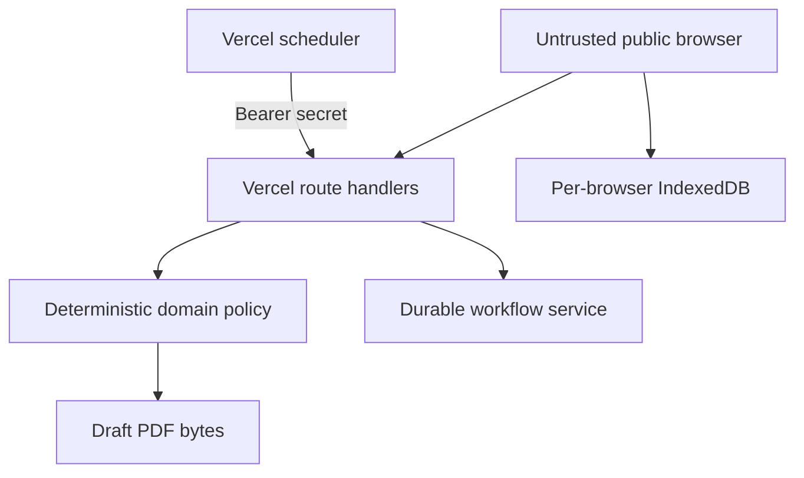

# Threat model

## Assets

Decision integrity, tenant separation, customer confidentiality, supplier cost and margin confidentiality, inventory consistency, document authenticity, audit continuity, deployment credentials and workflow availability.

## Trust boundaries

## Threats and controls

| Threat | Current control | Residual risk / production requirement |
|---|---|---|
| Real PII enters acquisition | no live acquisition connector; fixtures only | lawful-purpose review, minimization and deletion workflow |
| False sanctions conclusion | potential matches become `HOLD`; explicit non-conviction copy | licensed provider, fuzzy-match governance, reviewer and appeal path |
| Prompt or source injection | external text has no path to policy configuration; red-team tests | content isolation, model/tool allowlists and adversarial monitoring |
| Cross-tenant data import | tenant ID validation rejects mismatched snapshots | database row-level security and organization-scoped keys |
| Duplicate/oversold stock | idempotency keys, version checks, non-negative invariant | transactional database and warehouse reconciliation |
| Margin disclosure | separate customer portal projection | server-side authorization and response-schema tests |
| Forged/unsafe filing | mandatory watermark, draft labels and warnings | digital signatures, maker-checker approval and broker integration |
| Unauthorized scheduled run | bearer-secret enforcement; fail closed if unset | rotation, alerting and workload identity |
| Audit tampering | linked deterministic event hashes | append-only remote store, signed checkpoints and independent retention |
| Browser-state loss | export/import and deterministic reset | shared backups, point-in-time recovery and disaster drills |
| Dependency compromise | exact versions, lockfile, CI audit and Dependabot | provenance attestations, SBOM and controlled promotion |
| Public denial of service | managed Vercel edge/runtime protections | rate limits, WAF rules, budgets and incident response |

## Deliberately disabled effects

Real outreach, real contact enrichment, purchase transmission, customs filing, carrier instruction, invoice collection and payment are outside the public test. Enabling any one of them is a separate production decision, not a configuration toggle implied by this demo.
